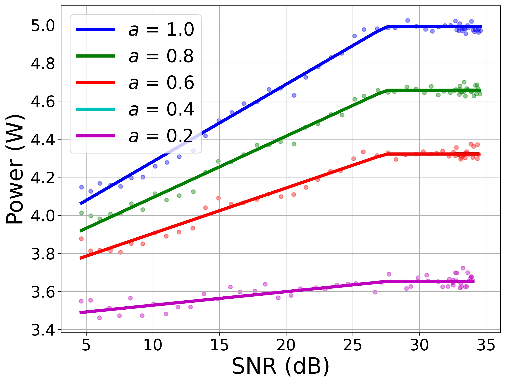
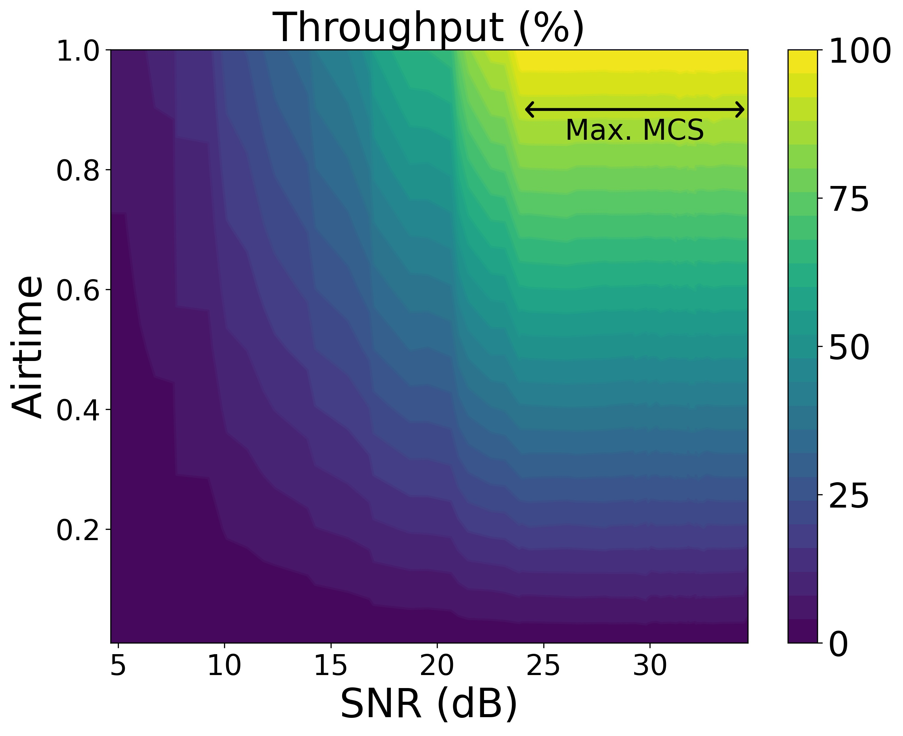
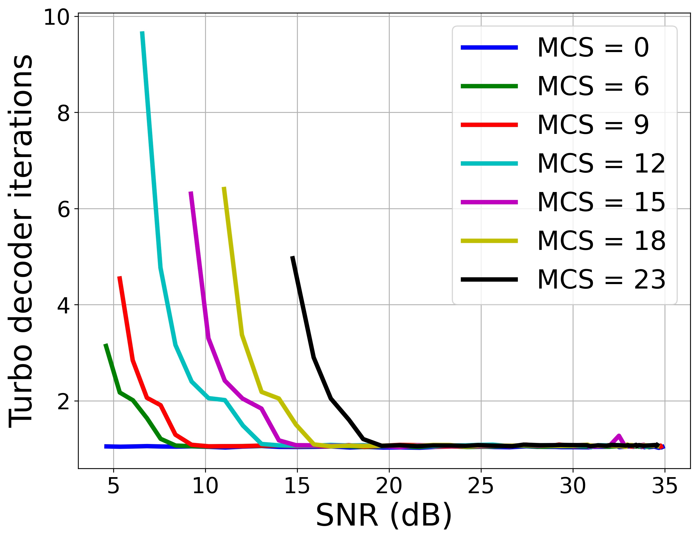
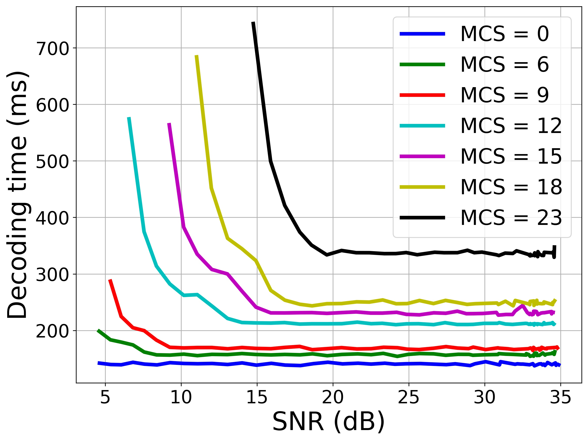
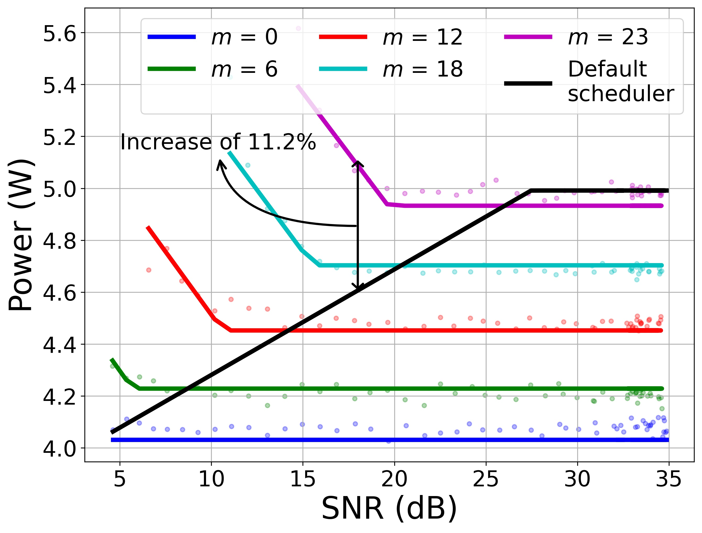
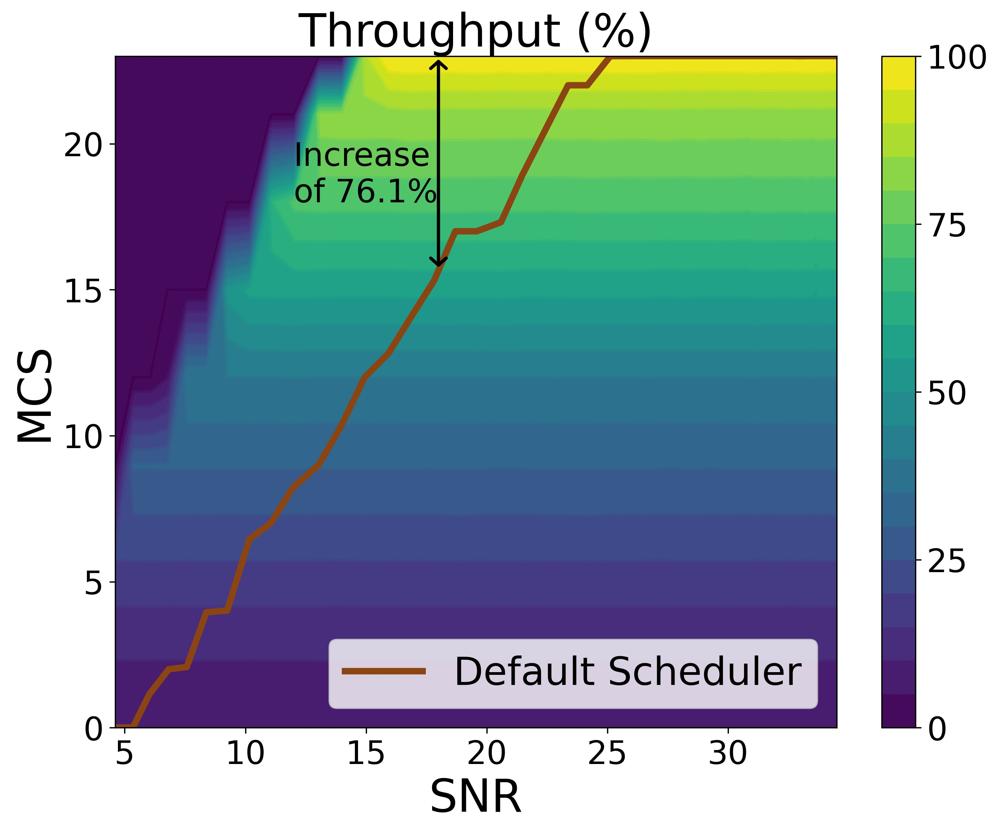
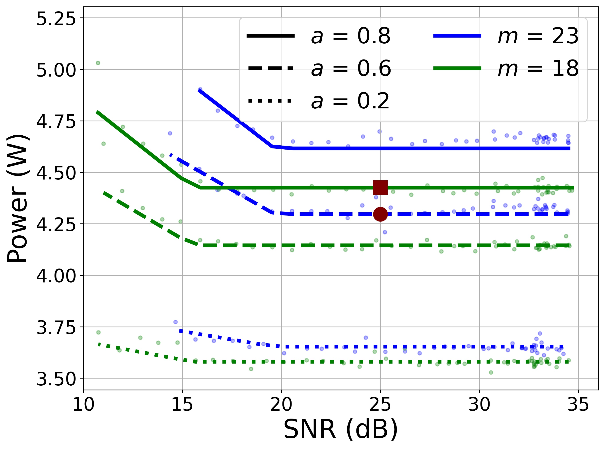
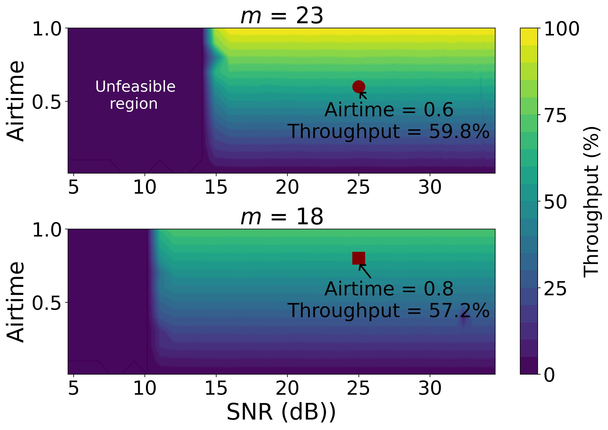

## Dataset

The file dataset_ul.csv provides a set of measurement of performance and power consumpetion of a virtualized Base Station (srseNB). The details of the experiments and the softwared and hardware used can be found in the paper:

Jose A. Ayala-Romero, Ihtisham Khalid, A. Garcia-Saavedra, X. Costa-Perez, G. Iosifidis (2021). Experimental Evaluation of Power Consumption in Virtualized Base Stations. IEEE ICC 2021.

- **Configurations:**

"date": Timestamp of the measurement \
"cpu_platform": CPU model of the computing platform running the BBU \
"BW": Bandwidth of the LTE interface in number of resource block. For instance, BW = 50 -> 10 MHz \
"TM": Transmission mode \
"UL/DL": Indicates if we consider the Uplink (UL), the downlink (DL), or both (DLUL) \
"traffic_load": Uplink traffic load \
"txgain": Transmission gain of the USRP implementing the UE \
"selected_mcs": Selected MCS on the uplink \
"selected_airtime": Selected airtime on the uplink \

- **Measurements:**

"mean_used_mcs": Average MCS used during the experiment on the uplink \
"bsr": Average Buffer Status Report uplink \
"num_ues": Number of UE associated with the BS \
"thr": Average throughput uplink \
"gput": Average Goodput uplink \
"mean_snr": Average SNR measured during the experiment on the uplink \
"bler": Average Block Error Rate uplink \
"turbodec_it": Average number of turbo decoder iterations during the experiment \
"overflows": Mean number of overflows (O) from UHD driver
"underflows": Mean number of underflows (U) from UHD driver
"lates": Mean number of Lates (L) from UHD driver
"dec_time": Average subframe decoding time (usec) \
"pm_power": Average power consumed by the BBU measured externally using the digital power meter \
"pm_var": Variance of the power consumed by the BBU measured externally using the digital power meter \
"n_pm": Number of samples of consumed power taken by the digital power meter during the experiment \
"rapl_power": Average power consumed by the CPU of the BBU measured using the RAPL functionality \
"rapl_var": Variance of the power consumed by the CPU of the BBU measured using the RAPL functionality \
"n_rapl": Number of samples of consumed power taken by the RAPL functionality during the experiment \
"clockspeed": Average clockspeed of the CPU running the BBU \
"nRBs": Average number of Resource Blocks used in the uplink \
"airtime": Average measured airtime on the uplink \
"fixed_mcs_flag": if 0, the value of the fields 'selected_mcs_dl' and 'selected_mcs_dl' is taken as an upper bound, i.e., the radio scheduler can select lower values for the MCS when it is required by the radio channel. If 1, the radio scheduler is forced to use these MCS values. When the channel quality is poor, decoding errors may occur \
"failed_experiment": If 1, it indicates that the experiment has failed due to decoding error \

## Code

We also include the source code used to plot the figures in the paper using the dataset presented above. To obtain the figures execute the bash script:
```
./get_figures.sh
```
The following set of figures will be plotted and stored in disk:

</img></img></img></img></img></img></img></img>

## Citing Work
If you use any code please cite the following:
```
@inproceedings{ayala2021experimental,
  title={Experimental Evaluation of Power Consumption in Virtualized Base Stations},
  author={Ayala-Romero, Jose A and Khalid, Ihtisham and Garcia-Saavedra, Andres and Costa-Perez, Xavier and Iosifidis, George},
  booktitle={2021 IEEE International Conference on Communications (ICC)},
  year={2021}
}
```


